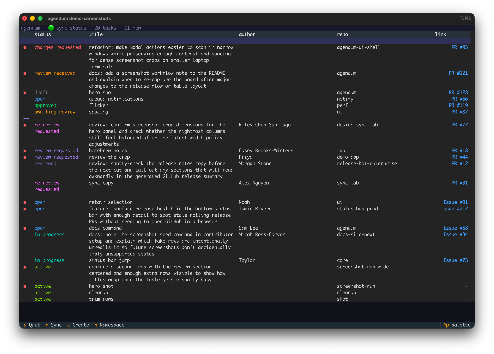

# agendum

The terminal dashboard for staying on top of GitHub PRs, reviews, issues, and follow-ups without leaving your pane.



## Install

```bash
brew install danseely/tap/agendum
```

Requires:
- [gh CLI](https://cli.github.com/) installed and authenticated (`gh auth login`)

For a non-interactive install check:

```bash
agendum self-check
```

On first run, you'll be prompted to configure your GitHub org. Config lives at `~/.agendum/config.toml`.

### Migrating From pip Or uv

If you previously installed `agendum` with `pip` or `uv`, remove the old install before using Homebrew so your shell does not pick up a stale executable.

Remove a `pip` install:

```bash
python -m pip uninstall agendum
```

Remove a `uv` tool install:

```bash
uv tool uninstall agendum
```

Then install the Homebrew version:

```bash
brew install danseely/tap/agendum
```

### Development Install

For local development or editable installs from a checkout:

```bash
uv tool install --editable /path/to/agendum
```

Requires:
- Python 3.11+
- [uv](https://docs.astral.sh/uv/)
- [gh CLI](https://cli.github.com/) installed and authenticated (`gh auth login`)

If `agendum` is not found after installing, add uv's tool directory to your shell:

```bash
uv tool update-shell
```

## Development Hooks

Install the local git hooks after syncing dev dependencies:

```bash
uv run pre-commit install --hook-type pre-commit --hook-type commit-msg
```

Commits and PR titles are expected to follow Conventional Commits, and releases follow SemVer. PR titles should be plain Conventional Commit subjects such as `fix: ...` or `docs(scope): ...`; do not add prefixes like `[codex]`.

## Development

```bash
uv sync --dev
uv run pre-commit install --hook-type pre-commit --hook-type commit-msg
```

This repo uses Conventional Commits and SemVer. PR titles should also follow Conventional Commits so squash merges remain release-friendly. Keep PR titles as plain Conventional Commit subjects without extra prefixes.

Merging a non-release PR into `main` creates or updates a rolling `release/next` PR with the version and changelog changes. If more PRs merge into `main` before release, that same release PR is updated in place and its target version is recalculated as needed. Merging the release PR publishes the GitHub tag and release.
That same `Release` workflow also dispatches `repository_dispatch` to `danseely/homebrew-tap` so the Homebrew tap can update from the release payload, rather than relying on a follow-on `release` event.

The first release still needs a one-time bootstrap tag if `main` does not yet contain a reachable release tag.

If you still have an older open release PR from a versioned branch such as `release/v0.1.1`, that PR will not be updated by the rolling workflow. The rolling workflow only updates the PR backed by `release/next`.
See [docs/release-hardening.md](docs/release-hardening.md) for the required GitHub rulesets and workflow permissions.

### Release checklist

From a maintainer point of view, the normal release flow is:

1. Merge feature PRs into `main`.
2. Let the automation create or update the rolling `release/next` PR.
3. Review the `release/next` PR and wait for its validation check to pass.
4. Merge `release/next` when you want to ship.
5. Wait for the `Release` workflow to publish the GitHub tag and release.
6. Wait for the `Release` workflow to dispatch the release payload to `danseely/homebrew-tap`.
7. Review and merge the Homebrew tap release PR after its CI passes.
8. If you want the separate Homebrew `pr-pull` publish path, trigger that in the tap after the release PR merge.

You should not normally need to run the replay workflow by hand. `Dispatch Homebrew Tap` exists as a manual replay path for missed dispatches, failed automation, or debugging.

## Usage

```bash
agendum
```

## README Screenshot Demo

To capture README screenshots with rich fake data in an isolated workspace:

```bash
agendum demo-screenshots
```

This launches the TUI against a disposable temp config and SQLite database, seeds a visually rich offline dataset, and leaves your real `~/.agendum` files untouched. Quit the app with `q` when you are done taking screenshots; the temporary workspace is cleaned up automatically.

## MCP Server

For local development, register the MCP server from this checkout. This avoids a separate tool install and keeps the MCP server using the code in your working tree.

Codex CLI:

```bash
codex mcp add agendum -- "$(which uv)" run --directory /path/to/agendum agendum-mcp
```

Claude Code:

```bash
claude mcp add agendum -- "$(which uv)" run --directory /path/to/agendum agendum-mcp
```

If your MCP client does not have an add command, configure the stdio server manually:

```json
{
  "mcpServers": {
    "agendum": {
      "command": "/path/to/uv",
      "args": ["run", "--directory", "/path/to/agendum", "agendum-mcp"]
    }
  }
}
```

Use the absolute path from `which uv` for `command`, and the absolute path to this checkout for `--directory`.

For a global command install instead:

```bash
uv tool install --reinstall --editable /path/to/agendum
```

Then register the installed executable:

```bash
codex mcp add agendum -- agendum-mcp
claude mcp add agendum -- agendum-mcp
```

Or configure it manually:

```json
{
  "mcpServers": {
    "agendum": {
      "command": "agendum-mcp"
    }
  }
}
```

If Claude can't find `agendum-mcp`, use the absolute path from `which agendum-mcp`.

Examples:
- "Create a new agendum task called follow up on telemetry PR"
- "Are there any open PRs waiting on my review?"
- "Did Alex review my API PR yet?"

## Keybindings

| Key | Action |
|-----|--------|
| `j` / `↓` | Move down |
| `k` / `↑` | Move up |
| `Enter` | Open action menu for selected task |
| `r` | Force sync now |
| `q` | Quit |

Type in the bottom input row to create a manual task.

## Config

`~/.agendum/config.toml`:

```toml
[github]
orgs = ["example-org"]
exclude_repos = []

[sync]
interval = 120

[display]
seen_delay = 3
```
